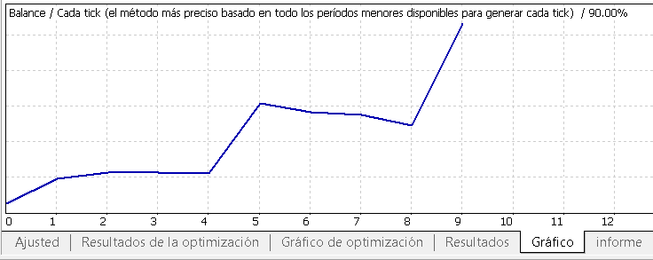

# EA_HedgePositions

## Description
This is a money management semi-automated investment strategy designed to manage the risk on your positions

## How it works
You have to do your own market analysis to determine whether the price of your preferred asset will go up or down.
Then, you set up the EA's parameters based on your analysis and the pair you are trading.
Finally, you just have to wait. You can sleep or do whatever you want, as the EA will manage the trades based on your analysis until it reaches your take profit.

## EA's logic
Our goal is to reduce drawdown as much as possible while we wait for the price to touch our target. 

If your analysis is wrong, you will lose. But in any case, this EA is expected to reduce your drawdown and improve your profit factor.

The EA doesn't setup visible stop losses and take profits, but that doesn't mean that we are exposed to a lot of risk as the EA will close both losing positions (and try to open it again later at a better price) and winning positions with risk of retracing. So, you are always protected in the same way as if you were using a stop loss.

EA will be using candles patterns as well as trailing price colliders to determine if it's time to open or close a position. 
Candle patterns example:

    
   
   

## Winning Backtest Example:
We'll take EURNOK as an example.
On 30/01/2019 we think that the price will go to 10.00000, so we setup the EA to start trading if the price drops to 9.65.
* startPrice = 9.65 //Price at which the EA starts trading
* TP = 10 //Take profit, our target
* hedgeDistance = 9000 //Price in points at which we close a position with a loss
* reOpenDistance = 10000 //Price in points at which we re-open a position that was closed with a loss before

If we buy 0.1 lots of EURNOK at 9.65 and sell it at 10 with a 10.000€ account, we would have earned 350€ (+3.5%).

However, using our EA you would have earned 545.91€ (+5.46%).

This is the data history of EURNOK price:

    

This is the result we get using our EA:

    

Difference between buy & hold and using our EA:

    

## Losing Backtest Example:
If we made an analysis of NZDCHF and thought that the price would go from 0.66 to 0.71, we would have been wrong.

If we buy 0.1 lots of NZDCHF at 0.66 and sell it at 0.62 with a 10.000€ account, we would have lost -400€ (-4%).

However, using our EA you would have lost only -72.55€ (-0.73%).

Our parameters:
* startPrice = 0.66
* TP = 0.71
* hedgeDistance = 900
* reOpenDistance = 900

This is the data history of NZDCHF price:

    

This is the result we get using our EA:

    

Difference between buy & hold and using our EA:

    

## Conclusion
Using our EA and the correct parameters, you earn the same when things go well and you lose less when things go bad.

That way you can create a better statistical expectancy to get better results.

However, results depend exclusively on your own analysis.

## Disclaimer
This code is disclosed publicly for educational purposes only.
Use at your own risk. 
I'm not responsible for any financial loss or damage caused by the use of this software.
